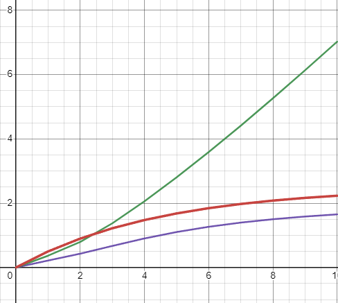
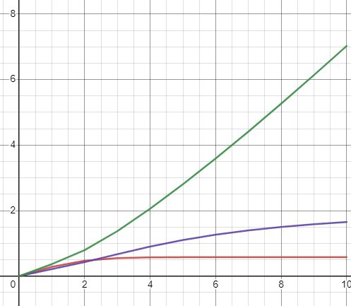

# 📘 Теория и методы автоматического управления

## 📖 О дисциплине
Дисциплина **"Теория и методы автоматического управления"** посвящена изучению принципов автоматического управления различными системами. В рамках лабораторных работ студенты осваивают математическое моделирование объектов управления, разработку алгоритмов регулирования, а также применение ПИД-регуляторов для управления динамическими системами.

Особенность курса заключается в том, что программная часть, разработанная в первых двух лабораторных работах, применяется в реальной лаборатории университета. Лаборатория была основана и финансируется компанией **"Савушкин продукт"** ([сайт компании](https://www.savushkin.com)). В дальнейших лабораторных работах студенты работали с реальными контроллерами, используя код, написанный ранее.

---

## 📂 Лабораторные работы
В рамках дисциплины выполнено **6 лабораторных работ**, из которых **первые две связаны с программированием**, а остальные четыре посвящены работе с контроллерами в лаборатории. Все лабораторные работы сдавались через **GitHub**, что позволило получить практический опыт использования систем контроля версий.

Полные материалы по всем лабораторным работам можно найти в репозитории:  
🔗 [GitHub-репозиторий](https://github.com/brstu/TMAU-2024/tree/main/trunk/as0006315)

---

### 🔹 Лабораторная работа №1: Моделирование температурного режима объекта
**🎯 Цель:** Разработать программу для моделирования температурного режима объекта с использованием **линейной** и **нелинейной** моделей.

**📌 Задачи:**
- Реализовать **линейную** модель температурного режима на основе уравнений теплопередачи.
- Разработать **нелинейную** модель, учитывающую нелинейные зависимости в системе.
- Реализовать методы вычисления температуры на каждом шаге симуляции.
- Вывести результаты в удобочитаемом формате.

**🛠️ Технологии:** C++, объектно-ориентированное программирование, моделирование динамических систем.

**✅ Результат:** Реализована программа, позволяющая вычислять и визуализировать изменение температуры объекта во времени при различных входных параметрах.

---

### 🔹 Лабораторная работа №2: Реализация PID-регулятора
**🎯 Цель:** Разработать **PID-регулятор** для управления объектом, используя математические модели, реализованные в **Лабораторной работе №1**.

**📌 Задачи:**
- Разработать класс **PID-регулятора**.
- Настроить параметры **пропорционального (P), интегрального (I) и дифференциального (D) управления**.
- Использовать полученные модели (линейную и нелинейную) в качестве объекта управления.
- Вывести результаты работы регулятора и проанализировать их.

**🛠️ Технологии:** C++, объектно-ориентированное программирование, алгоритмы управления.

**✅ Результат:** Реализован **PID-регулятор**, позволяющий корректировать поведение системы управления на основе отклонения от заданного значения.

---

### 🔹 Лабораторные работы №3-6: Практическое применение на контроллерах
В дальнейшем студенты применяли разработанные программы для работы с промышленными контроллерами **AXC F 2152**. В этих лабораторных работах рассматривались:

- **Лабораторная работа №3:** Подключение и работа с контроллером **AXC F 2152**.
- **Лабораторная работа №4:** Сборка проекта **ptusa_main** и его запуск на контроллере.
- **Лабораторная работа №5:** Развертывание проекта **T1-PLCnext-Demo** и тестирование его на стенде.
- **Лабораторная работа №6:** Работа с открытыми проектами, внесение изменений в код и участие в разработке.

Подробнее ознакомиться с этими работами можно в [GitHub-репозитории](https://github.com/brstu/TMAU-2024/tree/main/trunk/as0006315).

---

## 📊 Графики

### Линейная модель

### Нелинейная модель

---

## 📜 Итог
В результате выполнения лабораторных работ студенты осваивают **принципы автоматического управления**, знакомятся с **моделированием систем** и применением **PID-регуляторов** для коррекции поведения динамических объектов. Дополнительно они получают опыт **работы с реальными контроллерами**, применяя полученные знания на практике. Работа с **GitHub** в процессе сдачи лабораторных работ также способствует развитию навыков командной работы и версионного контроля.

