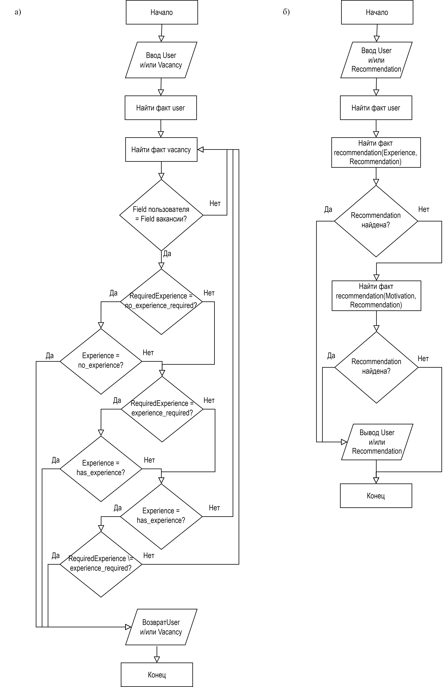

# 📚 Лабораторная работа №1: Продукционная модель представления знаний  

## 🔎 Описание  

Лабораторная работа посвящена разработке продукционной модели представления знаний в **Системе карьерного консультанта**.  

### 🎯 Цель  
- Разработка базы знаний на **Prolog**.  
- Определение подходящих вакансий для пользователей по опыту и профилю.  
- Формирование рекомендаций по развитию на основе мотивации и навыков.  

### 📄 Файлы  
- `lab_1.pl` – исходный код на Prolog с фактами, правилами и логикой.  
- `Блок-схема.png` – графическое представление алгоритма работы.  
- `Логическая схема.png` – логическая схема взаимосвязей между фактами и правилами.  
- `README.md` – описание проекта и инструкция по запуску.  

## 🛠️ Инструкция по запуску  

### Требования  
- Установленный интерпретатор SWI-Prolog.  
- Файл `lab_1.pl` в рабочем каталоге.  

### Шаги для запуска  
1. **Открыть SWI-Prolog:**  
   ```bash
   swipl
   ```  
2. **Загрузить файл:**  
   ```prolog
   ?- [lab_1].
   ```  
3. **Выполнить запросы:**  
   ```prolog
   ?- suitable_vacancy(ivan, Vacancy).
   ?- recommendation_for(maria, Recommendation).
   ```  

## 📊 Графики и схемы  

### 📌 Блок-схема  
`Блок-схема.png` визуализирует алгоритм выполнения:  
1. Ввод данных о пользователе.  
2. Анализ условий и проверка фактов.  
3. Вывод подходящих рекомендаций или вакансий.

<div align="center">

</div>
Блок-схемы для правил: а) suitable_vacancy, б) recommendation_for

### 📌 Логическая схема  
`Логическая схема.png` показывает взаимосвязь между фактами:  
- `recommendation_for/2` — рекомендация для пользователя.  
- `suitable_vacancy/2` — подходящие вакансии.

<div align="center">

</div>

## 🧩 Примеры запросов  

### Подбор вакансий для Ивана  
```prolog
?- suitable_vacancy(ivan, Vacancy).
Vacancy = programmer ;
Vacancy = junior_developer ;
false.
```  

### Рекомендации для Марии  
```prolog
?- recommendation_for(maria, Recommendation).
Recommendation = internship ;
Recommendation = online_courses ;
Recommendation = career_counseling ;
Recommendation = mentoring_program.
```  

### Определение пользователей с высокой мотивацией  
```prolog
?- user(User, _, _, _, high_motivation).
User = ivan ;
User = alexey ;
User = dmitry ;
User = olga ;
User = natalia.
```  

## 📌 Лицензия  
Проект разработан в рамках дисциплины **«Интеллектуальные системы»** и предназначен для образовательных целей.  
