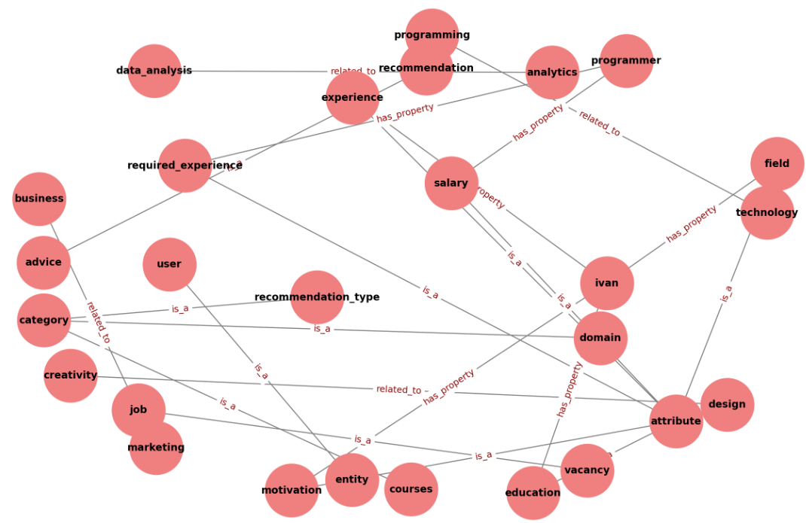

# 📚 Лабораторная работа №2: Семантическая сеть представления знаний

## 🔎 Описание

Лабораторная работа посвящена разработке **семантической сети** для **Системы карьерного консультанта**. 
Сеть описывает взаимосвязи между пользователями, вакансиями, рекомендациями и их характеристиками.

### 🎯 Цель
- Построение семантической сети для предметной области.
- Включение не менее 12 понятий и использование не менее 3 типов отношений.
- Реализация модели в **Prolog**.
- Выполнение запросов для анализа данных и проверки модели.

### 📄 Файлы
- `lab_2.pl` – исходный код на Prolog с фактами, правилами и логикой семантической сети.
- `Граф-семантической-сети.png` – графическое представление семантической сети.
- `README.md` – описание проекта и инструкция по запуску.

## 🛠️ Инструкция по запуску

### Требования
- Установленный интерпретатор SWI-Prolog.
- Файл `lab_2.pl` в рабочем каталоге.

### Шаги для запуска
1. **Открыть SWI-Prolog:**
   ```bash
   swipl
   ```
2. **Загрузить файл:**
   ```prolog
   ?- [lab_2].
   ```
3. **Выполнить запросы:**
   ```prolog
   ?- suitable_vacancy(ivan, Vacancy).
   ?- recommendation_for(maria, Recommendation).
   ```

## 📊 Графики и схемы

### 📌 Граф семантической сети
`Граф-семантической-сети.png` визуализирует связи между понятиями и их характеристиками в системе карьерного консультанта.

<div align="center">

</div>

## 🧩 Примеры запросов

1. related_to(programming, Domain). – Какие области связаны с программированием?
```prolog
Domain = technology.
```

2. is_a(vacancy, Class). – К какому классу принадлежит вакансия?
```prolog
Class = job.
```

3. has_property(ivan, Property, Value). – Какие свойства есть у Ивана?
```prolog
Property = education,
Value = graduate ;
Property = experience,
Value = no_experience ;
Property = field,
Value = programming ;
Property = motivation.
```

4. has_property(programmer, Property, Value). – Какие свойства есть у вакансии "программист"?
```prolog
Property = salary,
Value = high_salary ;
Property = required_experience,
Value = no_experience_required.
```

5. is_a(education, Class). – К какому классу принадлежит образование?
```prolog
Class = attribute.
```

## 📌 Лицензия
Проект разработан в рамках дисциплины **«Интеллектуальные системы»** и предназначен для образовательных целей.

