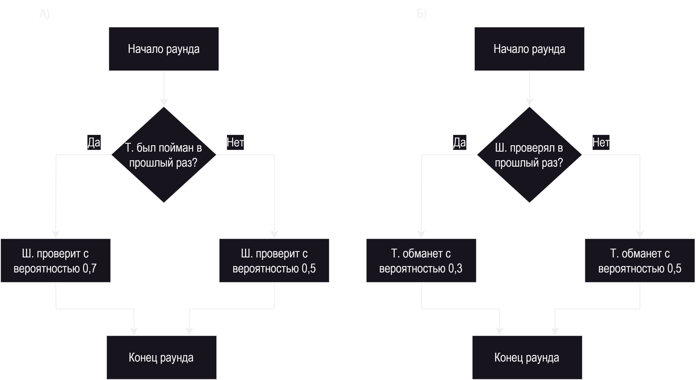

# 📚 Лабораторная работа №4: Машинное решение игры в смешанных стратегиях

## 📌 Цель работы  
Реализовать на языке Python стратегию для игры «Дилемма шерифа» в смешанных стратегиях.

## 📖 Описание игры: «Дилемма шерифа»  
Это игра на доверие и обман между двумя игроками — **шерифом** и **торговцем**.  
Каждый игрок принимает решение независимо:  

- **Шериф**: проверять или не проверять торговца.  
- **Торговец**: честно декларировать товар или везти контрабанду.

|                        | Шериф проверяет     | Шериф не проверяет   |
|------------------------|---------------------|-----------------------|
| **Торговец честный**   | -2 (Шериф), 0 (Торговец) | 0 (Шериф), 0 (Торговец) |
| **Торговец обманывает**| +3 (Шериф), -3 (Торговец) | -2 (Шериф), +1 (Торговец) |


## 🤖 Стратегии игроков

### 🔹 Торговец:
- Если в прошлом раунде его проверили — играет осторожно:  
  - 30% — обмануть  
  - 70% — не обмануть  
- Иначе:  
  - 50% / 50%

### 🔹 Шериф:
- Если в прошлом раунде поймал обманщика:  
  - 70% — снова проверит  
  - 30% — не проверит  
- Иначе:  
  - 50% / 50%

## 📊 Графики и схемы

### 📌 Алгоритмы выбора стратегий
Логическая схема алгоритмов выбора стратегий Шерифа (обозначен как Ш.) и Торговца (обозначен как Т.)

<div align="center">

</div>

## 🧠 Структура проекта

- `Sheriff` — класс с логикой принятия решений и запоминанием предыдущих ходов.
- `Trader` — класс с вероятностной стратегией на основе действий шерифа.
- `Game` — логика симуляции итераций, подсчёта баллов и вывода результатов.


## 🧪 Пример вывода (итерации)

```
Итерация        Шериф              Торговец
0               проверить = -2     обмануть = -3
1               не проверять = -2  обмануть = +1
...
```

## 📈 Результаты

Метод `printResults()` выводит итоговые очки игроков и определяет победителя.  
Например:
```
Шериф:
3
Торговец:
-2

Выиграл Шериф
```

## 💾 Запуск

Убедитесь, что установлен Python 3.x, затем выполните:

```bash
python main.py
```

## 📌 Лицензия  
Проект разработан в рамках дисциплины **«Интеллектуальные системы»** и предназначен для образовательных целей.
