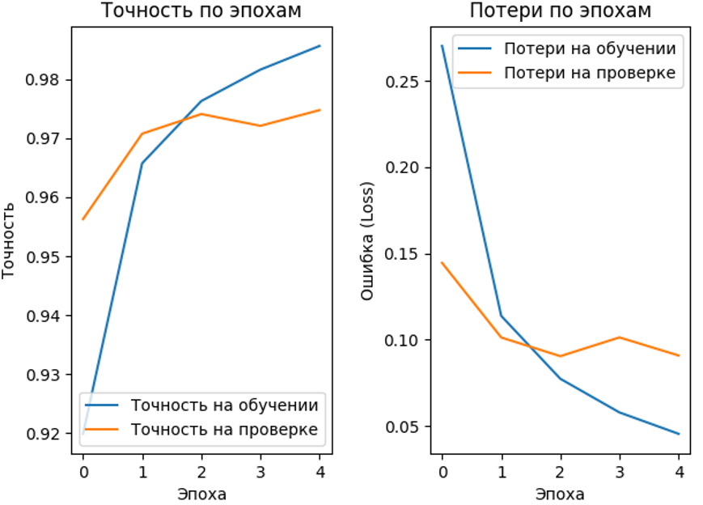
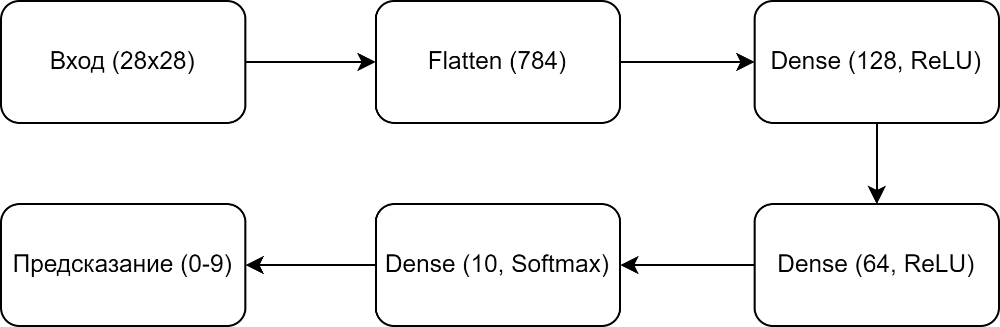

# 🧠 Лабораторная работа №5: Распознавание рукописных цифр с помощью нейросети (MNIST)

## 📌 Цель работы
Разработать приложение на языке Python, которое обучает и использует нейронную сеть для распознавания изображений рукописных цифр из датасета MNIST, а также умеет распознавать изображения, загруженные пользователем.

## 📝 Постановка задачи
Необходимо реализовать приложение, включающее:
- Создание или загрузку изображения цифры;
- Подготовку изображения к распознаванию;
- Обучение нейросети на базе MNIST;
- Тестирование модели на собственных изображениях.

## 📁 Файл лабораторной работы
В корне репозитория размещён файл **`Lab_5.ipynb`** — это основной ноутбук, реализующий весь функционал лабораторной работы. Он предназначен для запуска в [Google Colaboratory](https://colab.research.google.com/), что позволяет выполнять код онлайн без необходимости установки Python и библиотек на локальный компьютер.

Запустить ноутбук можно следующим образом:
1. Откройте [Google Colab](https://colab.research.google.com/).
2. Загрузите или откройте файл `Lab_5.ipynb` из своего Google Drive или GitHub.
3. Последовательно выполняйте ячейки кода.
4. При необходимости загрузите собственное изображение цифры (например, нарисованное в Paint).

## 🧩 Структура проекта
- **Загрузка данных**: импорт и нормализация датасета MNIST.
- **Обучение модели**: создание и настройка нейросети.
- **Тестирование**: проверка модели на тестовой выборке и пользовательских изображениях.
- **Визуализация**: отображение графиков обучения и архитектуры сети.

## 📾 Этапы выполнения

### 🔹 Подготовка данных
- Загружен датасет `MNIST` из `tensorflow.keras.datasets`.
- Проведена нормализация изображений (деление на 255.0).
- Метки классов преобразованы в формат one-hot с помощью `to_categorical()`.

### 🔹 Архитектура модели
- Использована модель `Sequential`.
- Последовательные слои:
  - `Input(shape=(28, 28))`
  - `Flatten()`
  - `Dense(128, activation='relu')`
  - `Dense(64, activation='relu')`
  - `Dense(10, activation='softmax')`

### 🔹 Обучение
- Функция потерь: `categorical_crossentropy`
- Оптимизатор: `adam`
- Эпохи: **5**
- Размер батча: `32`
- Валидационная выборка: `validation_split=0.2`

## 📊 Визуализация обучения

### 📈 Графики обучения нейронной сети
<div align="center">
  
</div>

### 🧠 Схема взаимодействия слоёв нейросети
<div align="center">
  
</div>

## 🖼️ Тестирование модели

После обучения модель тестируется на:
- Тестовой выборке `x_test`
- Изображениях, загруженных пользователем

### ↔️ Этапы обработки изображения
1. Перевод в оттенки серого (`convert('L')`)
2. Изменение размера до 28x28 пикселей
3. Инверсия цветов при необходимости
4. Нормализация пикселей
5. Предсказание с использованием обученной модели

## 🥯 Пример вывода
```bash
Test accuracy: 0.9814

Prediction: 7
Prediction: 2
Prediction: 1
...
```

## 🧉 Используемые библиотеки
- `tensorflow.keras`
- `numpy`
- `matplotlib`
- `PIL (Pillow)`
- `cv2`
- `google.colab.files`

## 📌 Лицензия
Проект выполнен в рамках дисциплины **«Интеллектуальные системы»** и предназначен исключительно для образовательных целей.

