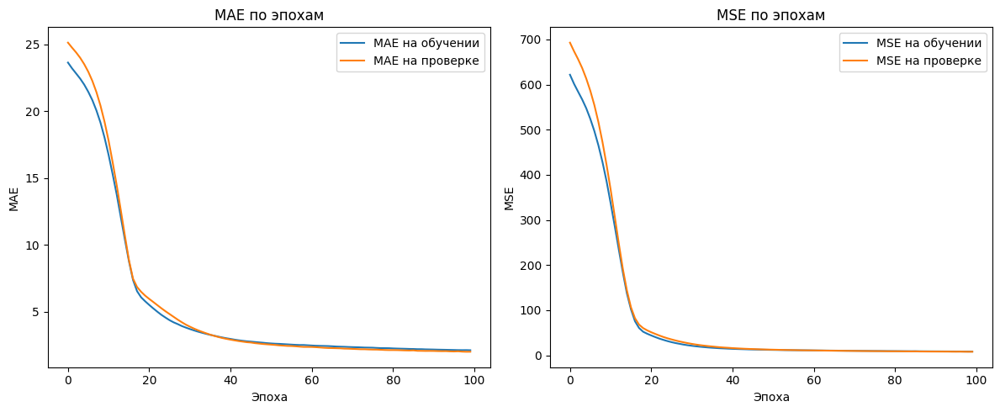
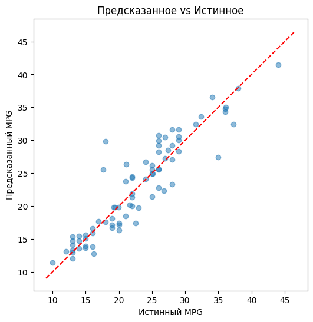

# 🧠 Лабораторная работа №7: Нейронные сети для решения задачи регрессии

## 📌 Цель работы

Научиться решать задачу регрессии с помощью полносвязных нейронных сетей: от подготовки табличного датасета до визуального анализа качества модели.

## 📝 Постановка задачи

1. Найти и загрузить датасет Auto MPG (UCI ML Repo).
2. Провести предобработку: убрать пропуски, стандартизировать признаки.
3. Разделить данные на обучающую (80%) и тестовую (20%) выборки.
4. Спроектировать и обучить многослойную персептронную сеть для предсказания расхода топлива (mpg).
5. Визуализировать кривые ошибок (MAE, MSE) и сравнение «предсказанное vs истинное».

## 🧩 Структура проекта

```
Lab_7/
├── images/
│   ├── mae_mse.png       # графики MAE и MSE
│   └── pred_vs_true.png  # scatter plot «предсказанное vs истинное»
└── Regression_Auto_Mpg.ipynb # исходный код скрипта
```

## 📾 Этапы выполнения

### 1. Подготовка и загрузка данных

* Считываем файл `auto-mpg.data` с учётом пропусков (`'?'`) и колонки `car_name` как текстового поля.
* Удаляем строки с `NaN` и столбец `car_name`.
* Разделяем DataFrame на матрицу признаков `X` и целевой вектор `y = mpg`.

### 2. Разделение выборок

* С помощью `train_test_split(test_size=0.2, random_state=42)` получили:

  * `X_train`/`y_train` – 80% для обучения.
  * `X_test`/`y_test` – 20% для финальной проверки.

### 3. Стандартизация признаков

* Применили `StandardScaler`:

  * `fit_transform` на `X_train`.
  * `transform` на `X_test`.

### 4. Построение и обучение модели

* Архитектура сети:

| № | Слой             | Выходная форма | Нейронов | Активация | Примечание                       |
| - | ---------------- | -------------- | -------- | --------- | -------------------------------- |
| 1 | Dense (входной)  | (None, 64)     | 64       | ReLU      | input\_shape = (7,)              |
| 2 | Dense (скрытый)  | (None, 32)     | 32       | ReLU      |                                  |
| 3 | Dense (выходной) | (None, 1)      | 1        | —         | линейная активация для регрессии |

* Компиляция:

  ```python
  model.compile(
      optimizer='adam',
      loss='mse',
      metrics=['mae','mse']
  )
  ```
* Обучение:

  ```python
  history = model.fit(
      X_train, y_train,
      epochs=100,
      batch_size=32,
      validation_split=0.2,
      verbose=0
  )
  ```

### 5. Визуализация результатов

#### MAE и MSE по эпохам

<div align="center">
  
</div>

#### Сравнение «предсказанное vs истинное»

<div align="center">
  
</div>

## 📊 Значения метрик на тестовой выборке

| Метрика | Значение |
| ------- | -------- |
| MAE     | 2.04     |
| MSE     | 8.17     |

## 📚 Список использованных источников

• Auto MPG Dataset \[Электронный ресурс] / UCI ML Repository. – Режим доступа: [http://archive.ics.uci.edu/ml/datasets/auto+mpg](http://archive.ics.uci.edu/ml/datasets/auto+mpg), свободный. – Дата обращения: 12.05.2025.
• Нейронные сети для решения задачи регрессии \[Электронный ресурс] / Урок. – Режим доступа: [https://lk.neural-university.ru/lesson/415?lp=152880](https://lk.neural-university.ru/lesson/415?lp=152880), свободный. – Дата обращения: 12.05.2025.
